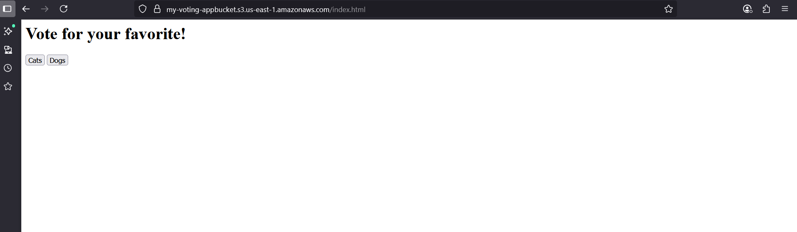
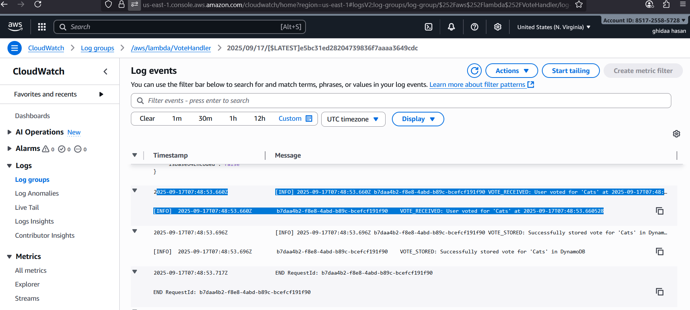

# AWS Voting App 

## Description
This project is a web-based voting application with a static frontend hosted on **AWS S3** and backend logic implemented in **AWS Lambda**.  
The deployment is automated using **AWS CodeBuild / CodePipeline**, ensuring that updates to the GitHub repository automatically deploy the latest version of the app.


## Project Structure

```
project-root/
 ├─ buildspec.yml
 ├─ index.html
 ├─ frontend/
    ├─ lambda-function.py


## Deployment

- **Frontend:** Hosted on **S3 static website**  
  - URL: `http://my-voting-appbucket.s3-website-us-east-1.amazonaws.com`  
- **Backend:** AWS Lambda function `VoteHandler`  
- **Pipeline:** GitHub → AWS CodeBuild → S3 + Lambda

---

## How to Run Locally / Test

1. **Clone the repository:**
```bash
git clone https://github.com/ghidaa123/app.git
cd app
```

2. **Install AWS CLI and configure credentials (for local testing):**
```bash
aws configure
```
- Enter your **AWS Access Key ID**, **Secret Access Key**, **Region** (`us-east-1`), and default output format (`json`)  
> Note: This step is only needed for local testing. The CI/CD pipeline already handles deployment automatically.

3. **Upload the frontend manually to S3 (optional testing):**
```bash
aws s3 cp index.html s3://my-voting-appbucket/index.html --region us-east-1
```

4. **Open the frontend in a browser:**
```
http://my-voting-appbucket.s3-website-us-east-1.amazonaws.com
```
- Cast votes using the UI and verify that Lambda processes them correctly.

5. **Verify voting results:**
- **CloudWatch Logs:** Go to CloudWatch → Log groups → `/aws/lambda/VoteHandler`  
  - Each vote should appear, e.g., `Received vote: cats`
- **DynamoDB Table:** Check the `vote-table` to see all recorded votes.

---

## Features

- Real-time voting backend with AWS Lambda  
- Static frontend hosted on AWS S3  
- CI/CD pipeline automates deployment  
- Debugging logs available in CloudWatch

##App Screenshots
Here's what the voting interface looks like in action:


And here's the CloudWatch logs showing votes being processed in real-time:



---

## AWS Resources Used

- **S3 Bucket** – Static website hosting  
- **Lambda Function** – `VoteHandler`  
- **DynamoDB Table** – `vote-table`  
- **CodeBuild / CodePipeline** – CI/CD deployment  
- **CloudWatch** – Monitoring and logs  

---

## How to Contribute

1. Fork the repo  
2. Make changes locally  
3. Commit and push to GitHub  
4. CI/CD pipeline automatically deploys changes
